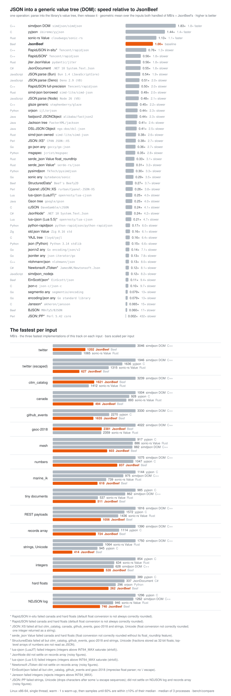
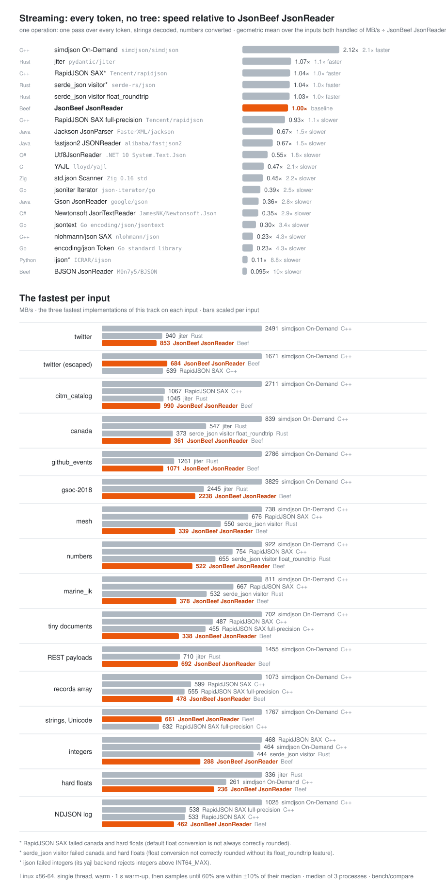
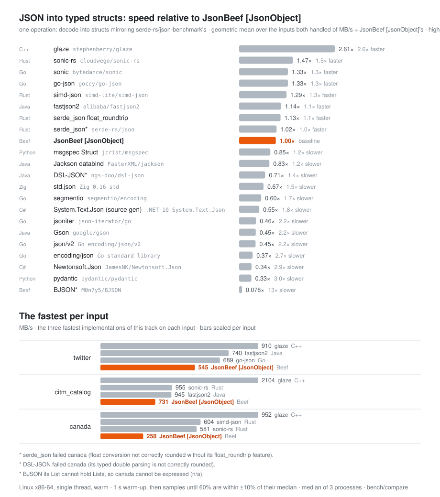
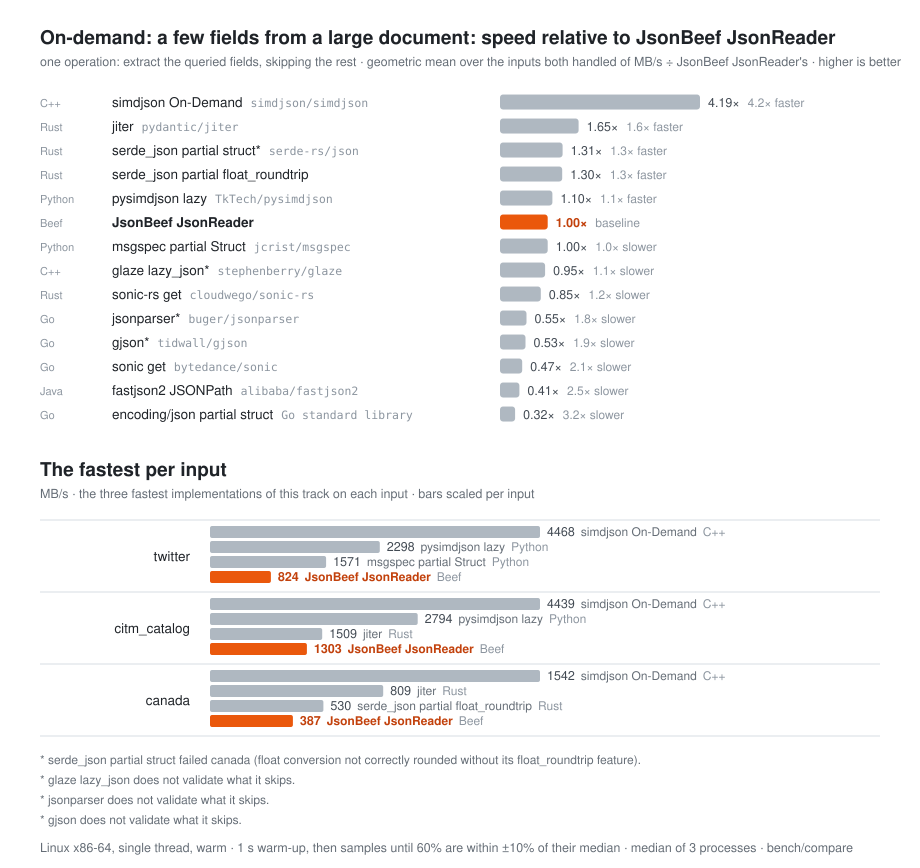
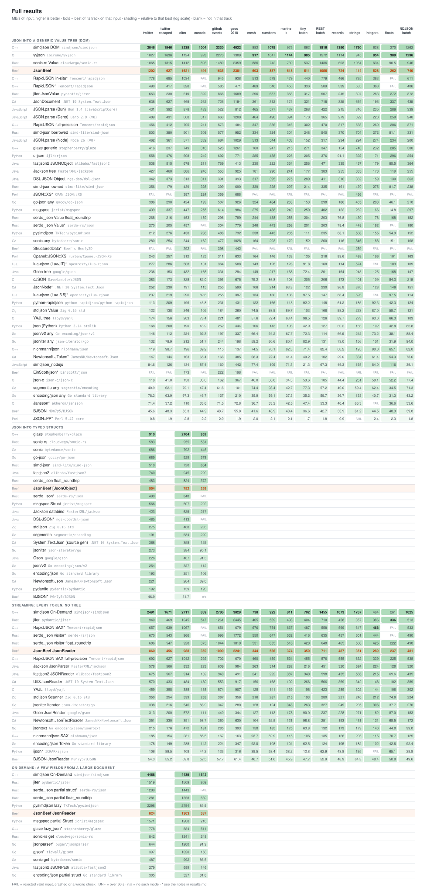

# JsonBeef

A JSON (RFC 8259) parser and writer for the [Beef](https://www.beeflang.org/) programming language:
fully correct by default, fast, with located errors and opt-in JSONC/JSON5/JSON Lines support. The
sibling of [TomlBeef](https://github.com/mdsitton/TomlBeef), KdlBeef and XmlBeef.

**Status: in development.** Done: the pull reader (`JsonReader`, memory and streams, with on-demand
`SkipValue`, `ReadRaw` and `Find`) and its fed form (`JsonPushReader`), which pass every conformance
suite; the document (`JsonDocument`:
lookups, JSON Pointer, mutation, positions, PreserveStyle round trips); the writers (compact, indented,
RFC 8785); JSONC, JSON5, non-finite numbers, I-JSON and replacement modes; JSON Lines, concatenated
and RFC 7464 sequences; JSON Patch and Merge Patch; collect-errors; and typed mapping (`docs/status.md`).

```beef
[JsonObject(Naming = .CamelCase)]
class Server
{
	public String HostName ~ delete _;
	public int32 Port = 8080;
	public List<String> Tags ~ DeleteContainerAndItems!(_);
}

let server = scope Server();
Try!(JsonSerializer.ReadFile("server.json", server));   // straight from the reader, every check on
server.Port = 8443;
Try!(JsonSerializer.WriteFile(server, "server.json", .Pretty));
```

## Performance

JsonBeef against the JSON implementations of 12 languages (48 others in the DOM track), in four
tracks that are never mixed:
parsing into a generic document (DOM), every token without a tree (streaming), into known types
(typed), and a few fields picked out of a large document (on-demand).

<p align="center"></p>

<p align="center"></p>

<p align="center"></p>

<p align="center"></p>

<p align="center"></p>

JsonBeef's document is second to fourth of 43–49 on most inputs, behind simdjson's DOM and level
with or ahead of yyjson and sonic-rs on the real-world files (twitter 1,202 MB/s, citm_catalog 1,621),
and its `JsonReader` is in jiter's class. Its weak spots are strings full of escapes, the typed
mapping (7th–8th, behind glaze, sonic-rs and go-json) and the on-demand query; `docs/status.md`
tracks them. JsonBeef checks everything as it reads (UTF-8, every escape, the number grammar) and
reads every number exactly, with no flags; several libraries in the tables round floats loosely or
reject large integers unless configured (`bench/compare/results.md` notes which).

Every implementation parses the same inputs (9 real-world files and 7 generated ones, ~39 MB) from
memory, single-threaded, on Linux x86-64, and must print the same check line as the reference
(counts of each value kind, decoded string lengths, an exact sum of every number), or its cell is
FAIL. Each harness warms up for 1 s, then samples until at least 60% of its samples are within ±10%
of their median; each cell then runs in fresh processes until 3 of them agree within ±10%, and the
median of those is reported (a cell that never settles is marked `~`). Library versions are pinned.
To reproduce, from `bench/compare/`:

```bash
./fetch.sh && ./build.sh && ./gen-inputs.py
./run.sh > results.md && ./plot.py           # every track (about 1.5 h), then docs/benchmark-*.svg
ONLY='JsonBeef.*' ./run.sh && ./plot.py      # later: remeasure only JsonBeef's columns, redraw
```

`bench/compare/results.md` has every table (MB/s, peak RSS, ns per document) and notes on each
harness.

## Documentation

The plan, requirements, design and research are in `docs/`:

- [`docs/plan.md`](docs/plan.md) — requirements, design, phases, open questions
- [`docs/architecture.md`](docs/architecture.md) — how the implementation works
- [`docs/status.md`](docs/status.md) — verification baseline, feature status, open items
- [`docs/spec-reference.md`](docs/spec-reference.md) — RFC 8259 and the extensions, rule by rule, with edge cases
- [`docs/test-suites.md`](docs/test-suites.md) — the test suites and corpora
- [`docs/implementation-survey.md`](docs/implementation-survey.md) — existing implementations in Beef and
  eight other languages
- [`bench/compare/`](bench/compare/) — the four-track benchmark of the existing implementations

## License

MIT (see `LICENSE`).
